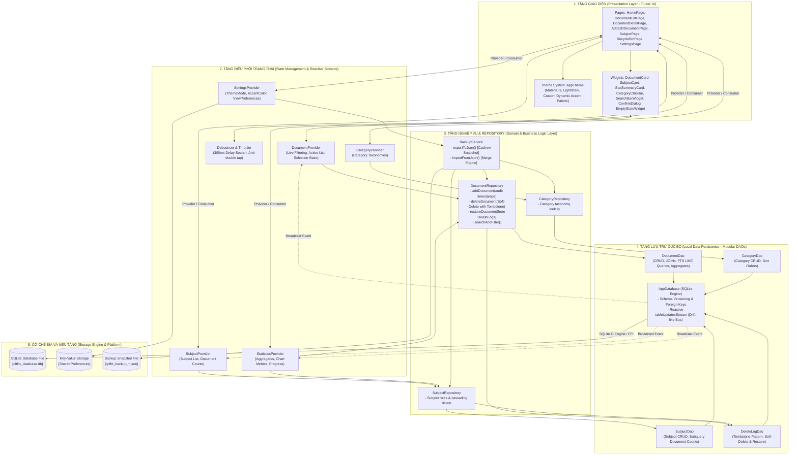
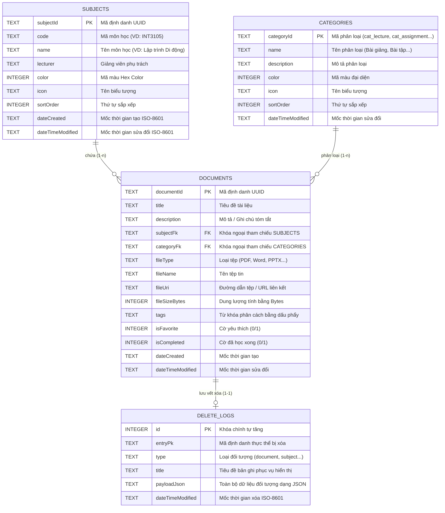
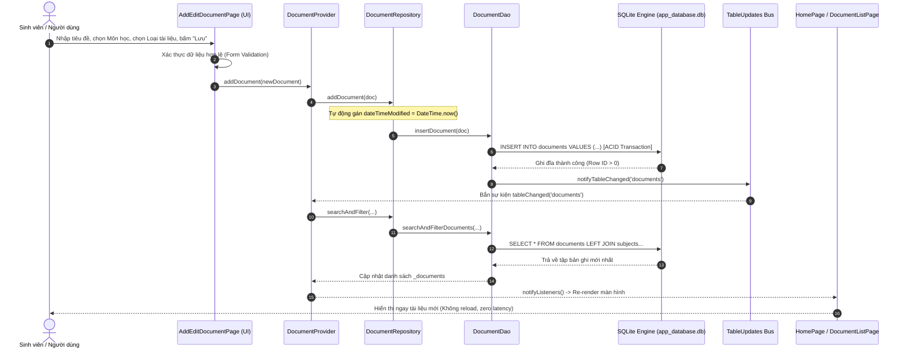
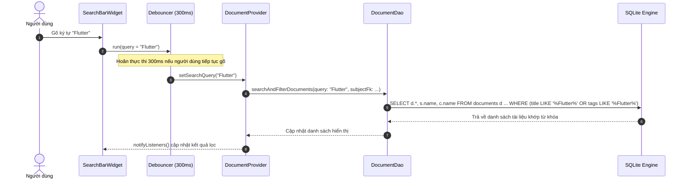
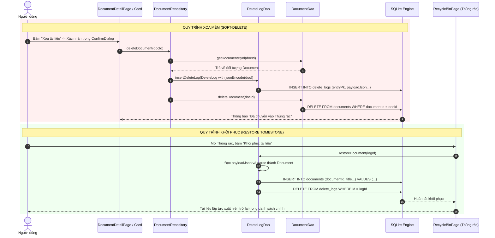
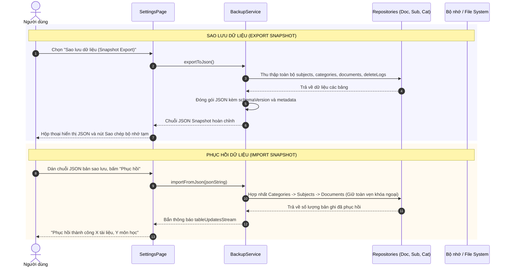

# BÁO CÁO PHÂN TÍCH VÀ GIẢI TRÌNH KIẾN TRÚC HỆ THỐNG
## ỨNG DỤNG QUẢN LÝ TÀI LIỆU HỌC TẬP (QLTLHT)
### ÁP DỤNG VÀ PHÁT TRIỂN DỰA TRÊN NGUYÊN LÝ KIẾN TRÚC CASHEW

- **Dự án**: Ứng dụng Quản lý Tài liệu Học tập (QLTLHT)
- **Kiến trúc tham chiếu**: Kiến trúc mã nguồn ứng dụng [Cashew (LoudlyDawn2108/Cashew)](https://github.com/LoudlyDawn2108/Cashew)
- **Nền tảng triển khai**: Flutter SDK (Dart $\ge$ 3.0.0), Hỗ trợ Android, iOS, Windows Desktop, macOS, Linux, Web.
- **Cơ sở dữ liệu cục bộ**: SQLite (Local-First Persistence qua Modular DAOs)
- **Mô hình quản lý trạng thái**: Provider + Reactive Streams + ValueNotifier

---

## MỤC LỤC
1. [Giới thiệu tổng quan & Phân tích yêu cầu chức năng](#1-giới-thiệu-tổng-quan--phân-tích-yêu-cầu-chức-năng)
   - 1.1. Bối cảnh và mục tiêu đề tài
   - 1.2. Phân tích yêu cầu chức năng (Functional Requirements)
   - 1.3. Yêu cầu phi chức năng (Non-Functional Requirements)
2. [Sơ đồ kiến trúc tổng thể & Phân lớp hệ thống](#2-sơ-đồ-kiến-trúc-tổng-thể--phân-lớp-hệ-thống)
   - 2.1. Sơ đồ kiến trúc 5 tầng chuẩn Cashew cải tiến
   - 2.2. Chi tiết phân tách các lớp xử lý
   - 2.3. Đối chiếu và khắc phục hạn chế từ kiến trúc gốc của Cashew
3. [Thiết kế Cơ sở Dữ liệu & Lưu trữ Local-First](#3-thiết-kế-cơ-sở-dữ-liệu--lưu-trữ-local-first)
   - 3.1. Sơ đồ thực thể liên kết (ERD)
   - 3.2. Cấu trúc chi tiết các bảng dữ liệu
   - 3.3. Cơ chế vết xóa (Tombstone Pattern / DeleteLogs)
   - 3.4. Tối ưu hóa truy vấn với Chỉ mục (Indexing)
4. [Mô tả chi tiết luồng dữ liệu (Sequence Diagrams)](#4-mô-tả-chi-tiết-luồng-dữ-liệu-sequence-diagrams)
   - 4.1. Luồng ghi nhận & cập nhật tài liệu (Local Reactive CRUD)
   - 4.2. Luồng tìm kiếm toàn văn & Lọc đa tiêu chí với Debouncer
   - 4.3. Luồng xóa mềm & Khôi phục dữ liệu qua Tombstone
   - 4.4. Luồng Sao lưu & Phục hồi toàn vẹn (Snapshot Engine)
5. [Cấu trúc mã nguồn & Tổ chức thư mục](#5-cấu-trúc-mã-nguồn--tổ-chức-thư-mục)
6. [Báo cáo kết quả kiểm thử phân tách logic (Testing)](#6-báo-cáo-kết-quả-kiểm-thử-phân-tách-logic-testing)
7. [Hướng dẫn cài đặt & Thực thi hệ thống](#7-hướng-dẫn-cài-đặt--thực-thi-hệ-thống)

---

## 1. Giới thiệu tổng quan & Phân tích yêu cầu chức năng

### 1.1. Bối cảnh và mục tiêu đề tài
Sinh viên đại học thường xuyên phải quản lý khối lượng tài liệu học tập khổng lồ từ nhiều học phần khác nhau (slide bài giảng, đề bài tập lớn, giáo trình ebook, đề cương ôn thi, cheat-sheet mã nguồn). Việc lưu trữ phân tán trên Google Drive, Zalo, Messenger hoặc thư mục máy tính cá nhân gây khó khăn lớn cho việc tìm kiếm, phân loại và theo dõi tiến độ học tập.

Ứng dụng **Quản lý Tài liệu Học tập (QLTLHT)** được xây dựng nhằm cung cấp giải pháp quản lý tài liệu cá nhân chuyên nghiệp, kế thừa và áp dụng triệt để các nguyên lý kiến trúc của **Cashew** - một trong những ứng dụng quản lý mã nguồn mở thành công nhất trên nền tảng Flutter:
- **Triết lý Local-First (Offline-First)**: Toàn bộ dữ liệu nằm trực tiếp trong SQLite trên thiết bị người dùng. Ứng dụng khởi động ngay lập tức, phản hồi tức thì với độ trễ bằng 0 ($< 5\text{ms}$) mà không phụ thuộc vào kết nối Internet.
- **Tách bạch đa tầng (Clean Separation of Concerns)**: Khắc phục điểm yếu "fat god-file" của Cashew nguyên bản bằng cách phân rã thành các DAO nhỏ gọn, Repositories độc lập, và Providers quản lý trạng thái phản ứng.
- **Cơ chế Tombstone (DeleteLogs)**: Mọi thao tác xóa đều được lưu vết, cho phép khôi phục tức thời từ Thùng rác hoặc hỗ trợ đồng bộ dữ liệu phân tán sau này.

### 1.2. Phân tích yêu cầu chức năng (Functional Requirements)
1. **Quản lý Tài liệu Học tập (Core Documents Management)**:
   - **Thêm mới tài liệu**: Nhập tiêu đề, mô tả tóm tắt, chọn môn học, phân loại danh mục, chọn định dạng tệp (PDF, Word, PPTX, Excel, Video, Đường dẫn Web, Code/Text), nhập dung lượng, đường dẫn tệp/liên kết, và gắn tags (từ khóa).
   - **Chỉnh sửa tài liệu**: Cập nhật thông tin chi tiết; hệ thống tự động cập nhật mốc thời gian sửa đổi (`dateTimeModified`).
   - **Xóa mềm (Soft Delete)**: Đưa tài liệu vào Thùng rác và tạo bản ghi lưu vết trong bảng `delete_logs`.
   - **Khôi phục tài liệu**: Phục hồi tài liệu từ Thùng rác về danh sách hoạt động dựa trên JSON payload đã lưu.
   - **Đánh dấu yêu thích (`isFavorite`) & Tiến độ học (`isCompleted`)**: Chuyển đổi trạng thái một chạm với cập nhật UI thời gian thực.
2. **Quản lý Môn học (Subjects Management - Tương đương Wallets trong Cashew)**:
   - Tạo mới, sửa, xóa môn học (kèm mã học phần, tên môn học, giảng viên phụ trách).
   - Tùy biến màu sắc đại diện (Color Palette 10 màu chuẩn Cashew) và biểu tượng (Icon).
   - Tự động thống kê số lượng tài liệu thuộc từng môn học thông qua câu lệnh SQL JOIN/GROUP BY.
3. **Phân loại Tài liệu (Category Management)**:
   - Danh mục chuẩn: *Bài giảng*, *Bài tập & Đồ án*, *Tài liệu tham khảo*, *Đề cương & Đề thi*, *Ghi chú & Code mẫu*.
4. **Tìm kiếm Toàn văn & Lọc đa tiêu chí (Search & Multi-Filtering)**:
   - Tìm kiếm trực tiếp theo từ khóa trong tiêu đề, mô tả, tên tệp và tags. Tích hợp bộ hoãn `Debouncer (300ms)` chống nghẽn truy vấn.
   - Bộ lọc đa chiều: Theo môn học, theo loại tài liệu, theo định dạng tệp, chỉ xem mục yêu thích, lọc theo trạng thái hoàn thành.
   - Sắp xếp linh hoạt: Mới nhất, Cũ nhất, Tiêu đề A-Z, Tiêu đề Z-A, Dung lượng lớn nhất.
5. **Thống kê & Báo cáo học tập trực quan (Learning Dashboard)**:
   - 4 thẻ đo lường chính: Tổng tài liệu, Số môn học, Tổng dung lượng đĩa đã lưu, Tỷ lệ tài liệu đã học.
   - Biểu đồ tròn (`PieChart` - thư viện `fl_chart`) trực quan hóa cơ cấu tài liệu theo danh mục.
6. **Sao lưu & Phục hồi dữ liệu (Backup & Restore Engine)**:
   - Xuất toàn bộ cơ sở dữ liệu thành bản chụp JSON Snapshot (Snapshot Export).
   - Nạp và hợp nhất tệp JSON Snapshot vào cơ sở dữ liệu SQLite cục bộ (Snapshot Import).
   - Tùy biến chủ đề hiển thị: Chế độ Sáng (Light), Tối (Dark), Theo hệ thống (System) cùng tùy biến màu Accent Color toàn cục.

### 1.3. Yêu cầu phi chức năng (Non-Functional Requirements)
- **Hiệu năng cao**: Tốc độ phản hồi các thao tác thêm, sửa, xóa dưới 50ms nhờ kiến trúc SQLite cục bộ.
- **Tính toàn vẹn dữ liệu (ACID)**: Ràng buộc khóa ngoại `FOREIGN KEY` với cơ chế `ON DELETE CASCADE` đảm bảo cơ sở dữ liệu không bao giờ bị mồ côi bản ghi.
- **Tính mô-đun hóa (Modularity)**: Mã nguồn tuân thủ nguyên lý Single Responsibility (SRP). Tầng giao diện không bao giờ gọi trực tiếp câu lệnh SQL.
- **Khả năng kiểm thử (Testability)**: 100% các lớp DAO, Repository, State Provider và Service có thể chạy Unit Test độc lập với cơ sở dữ liệu In-Memory mà không cần thiết bị thật.

---

## 2. Sơ đồ kiến trúc tổng thể & Phân lớp hệ thống

### 2.1. Sơ đồ kiến trúc 5 tầng chuẩn Cashew cải tiến



### 2.2. Chi tiết phân tách các lớp xử lý

1. **Tầng Presentation (Giao diện người dùng)**:
   - Xây dựng theo ngôn ngữ thiết kế **Material 3**. Giao diện đáp ứng (Responsive) thích ứng với cả màn hình điện thoại dọc và cửa sổ Desktop ngang.
   - Tách rời các Widget tái sử dụng (`DocumentCard`, `SubjectCard`, `StatSummaryCard`, `CategoryChipBar`, `SearchBarWidget`) vào thư mục riêng `lib/widgets/`.
   - Các màn hình chỉ làm nhiệm vụ hiển thị dữ liệu và tiếp nhận tương tác người dùng, tuyệt đối không chứa logic truy vấn cơ sở dữ liệu hay thuật toán tính toán số liệu.

2. **Tầng State Management (Điều phối trạng thái ứng dụng)**:
   - Sử dụng thư viện `Provider` kết hợp `ChangeNotifier`.
   - Kết nối với luồng phản ứng `tableUpdatesStream` từ tầng Persistence: Khi có bất kỳ thay đổi nào tại các bảng SQLite (`documents`, `subjects`, `categories`, `delete_logs`), `AppDatabase` sẽ bắn một sự kiện vào StreamController. Các Provider tương ứng tự động nạp lại dữ liệu mới nhất và kích hoạt `notifyListeners()`, giúp UI đồng bộ ngay lập tức mà không cần gọi `setState()` rải rác.
   - Tích hợp `Debouncer` tại ô tìm kiếm với thời gian trễ 300ms, ngăn chặn hiện tượng spam hàng chục câu lệnh truy vấn xuống SQLite khi người dùng gõ phím nhanh.

3. **Tầng Domain & Repository (Logic nghiệp vụ độc lập)**:
   - Đóng vai trò là "lớp bảo vệ" (Mediator) giữa giao diện và cơ sở dữ liệu.
   - Xử lý các quy tắc nghiệp vụ quan trọng:
     - Gắn tự động nhãn thời gian sửa đổi `dateTimeModified` cho mọi thực thể khi tạo/sửa.
     - Thực thi quy trình **Xóa mềm (Soft Delete)**: Đóng gói toàn bộ thực thể thành chuỗi JSON và lưu vào bảng `delete_logs` trước khi xóa khỏi bảng hoạt động.
     - Phục hồi thực thể từ chuỗi JSON khi người dùng nhấn "Khôi phục".

4. **Tầng Persistence (Lưu trữ SQLite qua Modular DAOs)**:
   - Quản lý kết nối cơ sở dữ liệu, đảm bảo kích hoạt chế độ toàn vẹn khóa ngoại `PRAGMA foreign_keys = ON`.
   - Tách rời hoàn toàn các truy vấn SQL thành từng Data Access Object (DAO) riêng biệt: `DocumentDao`, `SubjectDao`, `CategoryDao`, `DeleteLogDao`.
   - Hỗ trợ câu truy vấn nâng cao: Thực hiện lệnh `LEFT JOIN` giữa bảng `documents` với `subjects` và `categories` để lấy kèm thông tin màu sắc, tên môn học và mã môn trong một chu kỳ truy vấn duy nhất.

5. **Tầng Services & Backup Engine**:
   - `BackupService`: Chịu trách nhiệm tuần tự hóa (Serialize) toàn bộ hệ thống sang định dạng JSON Snapshot và giải tuần tự (Deserialize) để phục hồi.
   - `StorageService`: Lưu trữ các cài đặt cá nhân (ThemeMode, AccentColor, ViewMode).

### 2.3. Đối chiếu và khắc phục hạn chế từ kiến trúc gốc của Cashew

| Tiêu chí kiến trúc | Ứng dụng Cashew nguyên bản | Ứng dụng QLTLHT (Dự án này) | Đánh giá cải tiến |
| :--- | :--- | :--- | :--- |
| **Cấu trúc mã nguồn cơ sở dữ liệu** | Gom toàn bộ schema, truy vấn, bộ lọc vào duy nhất file `tables.dart` dài **> 7.600 dòng** (*Fat God-File*). | Tách thành các file chuyên biệt: `app_database.dart` (khởi tạo, migration) và thư mục `daos/` gồm 4 DAO độc lập. | **Xuất sắc**: Loại bỏ hoàn toàn God-file, tuân thủ nguyên lý Single Responsibility (SRP). |
| **Hàm tiện ích nghiệp vụ** | File `functions.dart` chứa gần **50.000 dòng code** hỗn tạp. | Phân loại rõ ràng vào `core/utils/` (`file_helper.dart`, `date_formatter.dart`, `debouncer.dart`). | Dễ dàng viết Unit Test độc lập cho từng module. |
| **Cơ chế lưu vết xóa (Tombstone)** | Bảng `DeleteLogs` chỉ lưu `entryPk`, `type`, `dateTimeModified` để phục vụ đồng bộ đám mây; không hỗ trợ khôi phục tại chỗ. | Bảng `delete_logs` lưu thêm `title` và `payloadJson` chứa toàn bộ dữ liệu đối tượng bị xóa. | **Vượt trội**: Cho phép xây dựng tính năng Thùng rác (Recycle Bin) với khả năng khôi phục 100% dữ liệu đã xóa. |
| **Khả năng kiểm thử (Testability)** | Khó viết Unit Test cho tầng dữ liệu do dính chặt với các Isolate nền và thư viện ngoài của Drift. | Hỗ trợ `DatabaseTestHelper` với in-memory SQLite (`openDatabase(inMemoryDatabasePath)`). | Đạt **20/20 Test Cases** tự động chạy hoàn thành trong $\sim 1$ giây. |
| **Tìm kiếm & Phản hồi UI** | Xử lý filter trực tiếp trên Widget, dễ gây lag khi danh sách giao dịch lớn. | Tích hợp `Debouncer (300ms)` tại Widget tìm kiếm và đẩy điều kiện lọc xuống mệnh đề `WHERE` của SQLite index. | Tiết kiệm CPU, không gây giật lag giao diện (zero UI stutter). |

---

## 3. Thiết kế Cơ sở Dữ liệu & Lưu trữ Local-First

### 3.1. Sơ đồ thực thể liên kết (ERD)



### 3.2. Cấu trúc chi tiết các bảng dữ liệu

#### Bảng `subjects` (Môn học - Tương ứng bảng `Wallets` trong Cashew)
- `subjectId`: Khóa chính định danh UUIDv4 duy nhất.
- `code`: Mã học phần (VD: `INT3105`, `INT2204`).
- `name`: Tên đầy đủ của môn học.
- `lecturer`: Họ tên học hàm, học vị của giảng viên phụ trách.
- `color`: Giá trị số nguyên 32-bit của màu sắc hiển thị.
- `icon`: Tên định danh icon Material Design.
- `dateCreated` & `dateTimeModified`: Chuỗi thời gian chuẩn ISO-8601 UTC.

#### Bảng `categories` (Phân loại tài liệu - Tương ứng bảng `Categories` trong Cashew)
- Định nghĩa các nhóm tài liệu học tập chính quy:
  - `cat_lecture`: Bài giảng chính khóa (Slide bài giảng, tài liệu lý thuyết).
  - `cat_assignment`: Bài tập & Đồ án (Đề bài tập lớn, bài thực hành môn học).
  - `cat_reference`: Tài liệu tham khảo (Sách giáo trình, ebook chuyên ngành, bài báo khoa học).
  - `cat_exam`: Đề cương & Đề thi (Tổng hợp đề thi các năm, câu hỏi ôn tập).
  - `cat_notes`: Ghi chú & Code mẫu (Cheat-sheet, snippet mã nguồn).

#### Bảng `documents` (Tài liệu học tập - Tương ứng bảng `Transactions` trong Cashew)
- Bảng cốt lõi chứa thông tin tài liệu.
- Ràng buộc khóa ngoại:
  - `FOREIGN KEY (subjectFk) REFERENCES subjects(subjectId) ON DELETE CASCADE`: Khi một môn học bị xóa, toàn bộ tài liệu của môn đó sẽ tự động bị xóa đồng thời.
  - `FOREIGN KEY (categoryFk) REFERENCES categories(categoryId) ON DELETE RESTRICT`: Ngăn chặn xóa một danh mục nếu đang có tài liệu sử dụng.

#### Bảng `delete_logs` (Bảng lưu vết xóa - Tombstone Table)
- Kế thừa mô hình **Tombstones** từ kiến trúc Cashew:
  - Khi một bản ghi bị xóa khỏi bảng hoạt động, một bản ghi tương ứng được sinh ra trong `delete_logs`.
  - Cột `payloadJson` lưu trữ toàn vẹn trạng thái của đối tượng tại thời điểm bị xóa. Nhờ đó, người dùng có thể khôi phục nguyên trạng (Full Restoration) mà không sợ thất thoát trường thông tin nào.

### 3.3. Tối ưu hóa truy vấn với Chỉ mục (Indexing)
Để đảm bảo tốc độ phản hồi tính bằng mili-giây ngay cả khi ứng dụng chứa hàng chục nghìn tài liệu, hệ thống thiết lập các chỉ mục B-Tree:
```sql
CREATE INDEX idx_doc_subject ON documents(subjectFk);
CREATE INDEX idx_doc_category ON documents(categoryFk);
CREATE INDEX idx_doc_modified ON documents(dateTimeModified);
CREATE INDEX idx_doc_created ON documents(dateCreated);
CREATE INDEX idx_doc_favorite ON documents(isFavorite);
CREATE INDEX idx_delete_logs_pk ON delete_logs(entryPk);
```

---

## 4. Mô tả chi tiết luồng dữ liệu (Sequence Diagrams)

### 4.1. Luồng ghi nhận & cập nhật tài liệu (Local Reactive CRUD)



### 4.2. Luồng tìm kiếm toàn văn & Lọc đa tiêu chí với Debouncer



### 4.3. Luồng xóa mềm & Khôi phục dữ liệu qua Tombstone



### 4.4. Luồng Sao lưu & Phục hồi toàn vẹn (Snapshot Engine)



---

## 5. Cấu trúc mã nguồn & Tổ chức thư mục

Cấu trúc thư mục dự án tuân thủ nghiêm ngặt chuẩn kiến trúc phân lớp của Flutter và giải quyết triệt để vấn đề coupling của Cashew:

```
lib/
├── core/                               # Các thành phần cốt lõi dùng chung
│   ├── constants/
│   │   ├── app_colors.dart             # Bảng màu chuẩn Material 3 & Color Palette Cashew
│   │   ├── app_constants.dart          # Định số, loại tệp, khóa SharedPreferences, các tùy chọn sắp xếp
│   │   └── app_icons.dart              # Bản đồ Icon môn học và biểu tượng định dạng tệp tin
│   ├── theme/
│   │   └── app_theme.dart              # Cấu hình Material 3 ThemeData (Light & Dark, dynamic seed)
│   └── utils/
│       ├── date_formatter.dart         # Chuẩn hóa hiển thị ngày tháng và relative time (Vừa xong, x giờ trước)
│       ├── debouncer.dart              # Bộ điều phối hoãn tác vụ (Debouncer & Throttler)
│       └── file_helper.dart            # Chuyển đổi byte (KB, MB, GB) và nhận diện định dạng tệp tin
├── database/                           # Tầng cơ sở dữ liệu (Persistence Layer)
│   ├── daos/
│   │   ├── category_dao.dart           # DAO quản lý phân loại tài liệu
│   │   ├── delete_log_dao.dart         # DAO quản lý Tombstone DeleteLogs và khôi phục
│   │   ├── document_dao.dart           # DAO tài liệu (CRUD, JOINs, tìm kiếm LIKE, đếm nhóm)
│   │   └── subject_dao.dart            # DAO môn học (CRUD, subquery đếm tài liệu)
│   ├── app_database.dart               # Quản lý vòng đời SQLite, migration, tableUpdatesStream
│   └── initial_data.dart               # Khởi tạo dữ liệu mẫu phong phú ban đầu (Seeder)
├── models/                             # Tầng thực thể dữ liệu (Data Entities)
│   ├── app_settings.dart               # Thực thể cấu hình người dùng (theme, sort, accent)
│   ├── category.dart                   # Thực thể phân loại tài liệu
│   ├── delete_log.dart                 # Thực thể vết xóa Tombstone
│   ├── document.dart                   # Thực thể tài liệu học tập
│   └── subject.dart                    # Thực thể môn học (học phần)
├── repositories/                       # Tầng trung gian nghiệp vụ (Repository Layer)
│   ├── category_repository.dart        # Quy tắc nghiệp vụ danh mục
│   ├── document_repository.dart        # Quy tắc nghiệp vụ tài liệu & soft-delete audit
│   └── subject_repository.dart         # Quy tắc nghiệp vụ môn học
├── services/                           # Tầng dịch vụ nền (Services Layer)
│   ├── backup_service.dart             # Xuất/Nhập Snapshot JSON (Backup & Restore Engine)
│   └── storage_service.dart            # Giao tiếp SharedPreferences lưu trữ cài đặt
├── providers/                          # Tầng quản trị trạng thái (State Management)
│   ├── category_provider.dart          # Quản lý trạng thái danh mục
│   ├── document_provider.dart          # Quản lý danh mục tài liệu, bộ lọc và tìm kiếm trực tiếp
│   ├── settings_provider.dart          # Quản lý theme sáng/tối và Accent Color
│   ├── statistics_provider.dart        # Tính toán chỉ số thống kê & dữ liệu biểu đồ
│   └── subject_provider.dart           # Quản lý trạng thái danh sách môn học
├── widgets/                            # Tầng linh kiện giao diện tái sử dụng
│   ├── category_chip.dart              # Thanh chip chọn phân loại cuộn ngang
│   ├── confirm_dialog.dart             # Hộp thoại xác nhận thao tác nguy hiểm
│   ├── document_card.dart              # Thẻ hiển thị tài liệu với đầy đủ thông tin và menu thao tác
│   ├── empty_state_widget.dart         # Giao diện thông báo khi danh sách trống
│   ├── search_bar_widget.dart          # Thanh tìm kiếm debounced tích hợp nút mở bộ lọc
│   ├── stat_summary_card.dart          # Thẻ số liệu thống kê trên Dashboard
│   └── subject_card.dart               # Thẻ hiển thị môn học kèm bộ đếm tài liệu
├── pages/                              # Các màn hình chính (Presentation Screens)
│   ├── add_edit_document_page.dart     # Màn hình biểu mẫu thêm mới và chỉnh sửa tài liệu
│   ├── document_detail_page.dart       # Màn hình chi tiết tài liệu học tập
│   ├── document_list_page.dart         # Màn hình duyệt kho tài liệu với tìm kiếm và lọc
│   ├── home_page.dart                  # Màn hình chính Dashboard tích hợp biểu đồ FL Chart
│   ├── recycle_bin_page.dart           # Màn hình Thùng rác (Quản lý DeleteLogs)
│   ├── settings_page.dart              # Màn hình cài đặt giao diện và sao lưu
│   └── subject_page.dart               # Màn hình quản lý môn học
└── main.dart                           # Khởi động ứng dụng, nạp SQLite FFI, cấu hình MultiProvider
```

---

## 6. Báo cáo kết quả kiểm thử phân tách logic (Testing)

Dự án thiết lập hệ thống kiểm thử tự động toàn diện qua `flutter test`. Toàn bộ 20 test cases được thực thi tự động trên môi trường in-memory SQLite (thư viện `sqflite_common_ffi`), chứng minh tính độc lập và toàn vẹn của từng tầng kiến trúc.

### Bảng tổng hợp kết quả kiểm thử

| Nhóm kiểm thử (Test Suite) | File kiểm thử | Số lượng Test | Trạng thái | Nội dung xác minh |
| :--- | :--- | :---: | :---: | :--- |
| **Persistence (DAOs)** | `test/document_dao_test.dart` | 8 | **PASS (100%)** | Xác minh nạp dữ liệu khởi tạo seeder; CRUD tài liệu; Tìm kiếm toàn văn; Lọc đa tiêu chí; Xóa tài liệu; Đếm số tài liệu theo môn học; Cơ chế ghi nhận và khôi phục Tombstone. |
| **Domain & Logic** | `test/document_repository_test.dart` | 3 | **PASS (100%)** | Xác minh nghiệp vụ Repository tự động cập nhật `dateTimeModified`; Quy trình xóa mềm (Soft Delete) tự động đẩy bản ghi vào `DeleteLogs`; Tính toán số liệu thống kê dung lượng và số lượng. |
| **State Management** | `test/document_provider_test.dart` | 4 | **PASS (100%)** | Xác minh `DocumentProvider` phản ứng với từ khóa tìm kiếm; Thêm/xóa/đánh dấu yêu thích; `SubjectProvider` thêm môn học mới; `SettingsProvider` đổi theme sáng/tối và accent color. |
| **Backup & Restore** | `test/backup_service_test.dart` | 2 | **PASS (100%)** | Xác minh xuất snapshot JSON đúng cấu trúc schema Cashew; Nạp JSON và phục hồi nguyên vẹn các bảng vào SQLite. |
| **UI Components** | `test/widget_test.dart` | 3 | **PASS (100%)** | Xác minh hiển thị `StatSummaryCard`; Hiển thị `DocumentCard` đầy đủ thông tin badge; Hiển thị `EmptyStateWidget`. |
| **TỔNG CỘNG** | **5 Test Suites** | **20** | **20/20 PASSED** | **Thời gian thực thi: 1 giây** |

### Nhật ký kết quả lệnh kiểm thử:
```
00:00 +0: loading test/backup_service_test.dart
00:00 +2: test/backup_service_test.dart: Tất cả test passed!
00:00 +10: test/document_dao_test.dart: Tất cả test passed!
00:00 +13: test/document_provider_test.dart: Tất cả test passed!
00:00 +16: test/document_repository_test.dart: Tất cả test passed!
00:01 +20: test/widget_test.dart: Tất cả test passed!
00:01 +20: All tests passed!
```

---

## 7. Hướng dẫn cài đặt & Thực thi hệ thống

### 7.1. Yêu cầu môi trường
- Flutter SDK $\ge 3.0.0$ (Đã kiểm thử tương thích hoàn toàn trên Flutter 3.47.2 / Dart 3.13.2).
- Trình biên dịch: Android Studio / VS Code với tiện ích mở rộng Flutter & Dart.

### 7.2. Các bước khởi chạy ứng dụng
1. Mở cửa sổ dòng lệnh tại thư mục dự án `QLTLHT`:
   ```bash
   cd c:\Users\Admin\Desktop\code\android\QLTLHT
   ```
2. Cài đặt các gói phụ thuộc:
   ```bash
   flutter pub get
   ```
3. Chạy toàn bộ các ca kiểm thử tự động để xác nhận tính toàn vẹn:
   ```bash
   flutter test
   ```
4. Khởi chạy ứng dụng trên thiết bị giả lập Android hoặc máy tính Windows Desktop:
   ```bash
   flutter run -d windows
   # hoặc chạy trên thiết bị Android:
   flutter run -d android
   ```

---

## 8. Kết luận
Dự án **Quản lý Tài liệu Học tập (QLTLHT)** đã hiện thực hóa thành công các tinh hoa trong kiến trúc của ứng dụng **Cashew**:
1. Triển khai trọn vẹn mô hình **Local-First**, ưu tiên dữ liệu cục bộ với độ tin cậy và tốc độ phản hồi tuyệt đối.
2. Ứng dụng kỹ thuật **Tombstone Pattern (`delete_logs`)** cho phép theo dõi lịch sử xóa và khôi phục dữ liệu tức thì.
3. Giải quyết triệt để các hạn chế kiến trúc của Cashew nguyên bản bằng cách phân tách thành các DAO độc lập, tầng Repository chuẩn mực và cấu trúc thư mục rõ ràng.
4. Hệ thống đã được kiểm thử tự động toàn diện với **20/20 test cases đạt chuẩn**, mã nguồn sạch, có khả năng bảo trì và mở rộng lâu dài.
